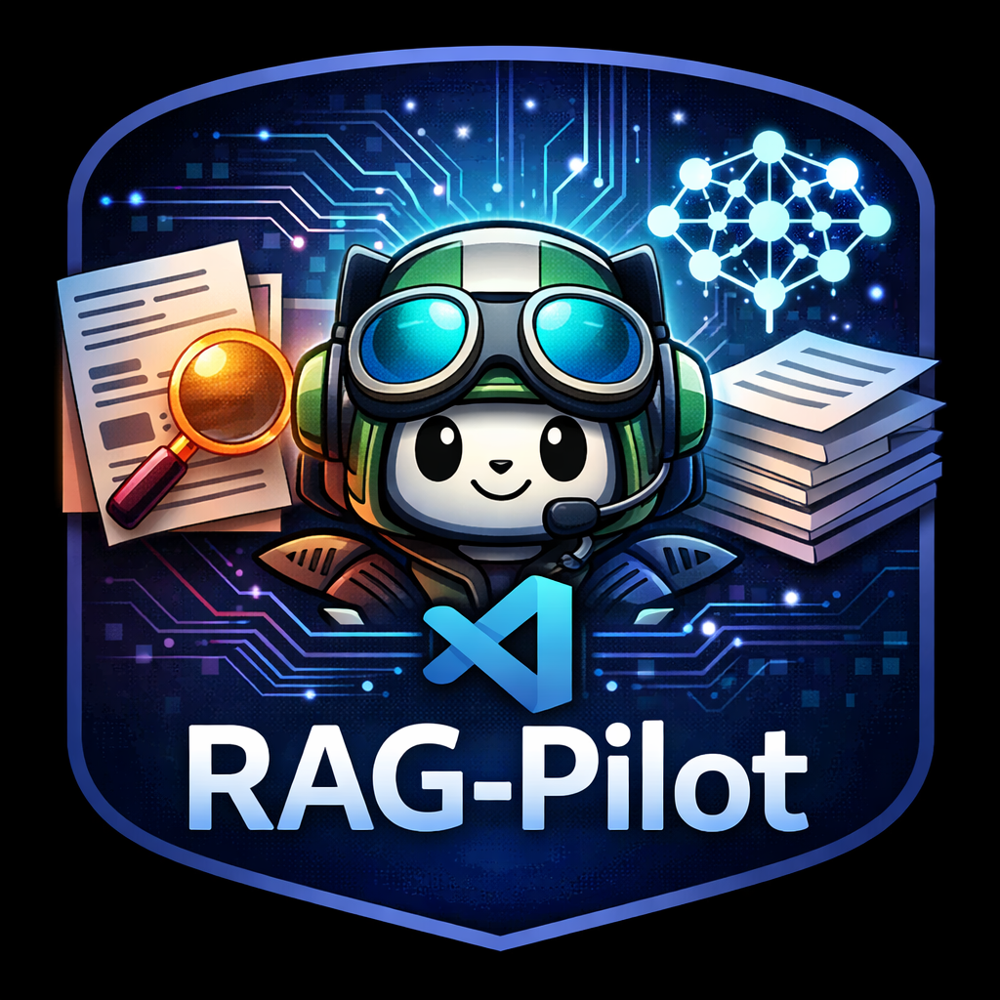

<div align="center">
  
  
  # RAG Pilot
  
  [](https://marketplace.visualstudio.com/)
  [](https://opensource.org/licenses/MIT)
  
  **Supercharge GitHub Copilot with Retrieval-Augmented Generation (RAG)**
  
  Give Copilot context from your workspace and any GitHub repository
</div>

---

RAG Pilot is a Visual Studio Code extension that enhances GitHub Copilot by adding semantic search capabilities. Index your codebase and external GitHub repositories, then ask Copilot questions with full context awareness.

## ✨ Features

- 🔍 **Semantic Search** - Find relevant code using AI embeddings, not just keywords
- 📚 **Multi-Source Context** - Combine workspace code + external GitHub repos
- 🤖 **GitHub Copilot Integration** - Uses your existing Copilot subscription
- 📍 **Source Citations** - See which files/repos were used in answers
- 💾 **Persistent Index** - Embeddings stored locally for instant retrieval
- ⚡ **Flexible Indexing** - Index entire workspace, specific folders, or individual files
- 🎯 **Right-Click Integration** - Index files/folders directly from Explorer

## 🚀 Quick Start

### 1. Install the Extension

Search for "RAG Pilot" in the VS Code Extensions marketplace and install it.

### 2. Index Your Code

**Option A: Index Entire Workspace**
- Open Command Palette (`Ctrl+Shift+P` / `Cmd+Shift+P`)
- Run: `RAG Pilot: Index Workspace for Vector Search`

**Option B: Index Specific Folder**
- Right-click any folder in Explorer
- Select `RAG Pilot: Index Specific Folder`

**Option C: Index Selected Files**
- Select one or more files in Explorer
- Right-click → `RAG Pilot: Index Selected Files`

### 3. Add External Repositories (Optional)

- Run: `RAG Pilot: Add GitHub Repository`
- Enter repo: `owner/repo` or full GitHub URL
- Wait for download and indexing

### 4. Ask Questions

**Keyboard Shortcut (Fastest):**
- Press `Ctrl+Shift+R` (Windows/Linux) or `Cmd+Shift+R` (Mac)
- Type your question

**Chat Interface:**
- Open GitHub Copilot Chat
- Type `@rag` followed by your question
- After first use, it stays active (sticky mode)

## 📖 Usage Examples

```
@rag how does authentication work in this codebase?
```

```
@rag show me examples of API error handling
```

```
@rag (after indexing react repo) explain how React hooks are implemented
```

## 🛠️ Commands

| Command | Description | Shortcut |
|---------|-------------|----------|
| RAG Pilot: Index Workspace | Index entire workspace | - |
| RAG Pilot: Index Specific Folder | Index selected folder | Right-click folder |
| RAG Pilot: Index Selected Files | Index one or more files | Right-click files |
| RAG Pilot: Add GitHub Repository | Download & index a repo | - |
| RAG Pilot: List Indexed Sources | View all indexed sources | - |
| RAG Pilot: Remove Repository | Remove repo from index | - |
| RAG Pilot: Clear Vector Index | Clear entire index | - |
| RAG Pilot: Open Chat | Open chat with @rag | `Ctrl+Shift+R` |

## ⚙️ Configuration

```json
{
  // Automatically include RAG context in all chat requests (experimental)
  "copilot-rag.autoAttach": false,
  
  // File patterns to include when indexing (glob patterns)
  "copilot-rag.includePatterns": [
    "**/*.ts", "**/*.js", "**/*.py", "**/*.java", 
    "**/*.cpp", "**/*.go", "**/*.rs", "**/*.md"
  ],
  
  // File patterns to exclude (glob patterns)
  "copilot-rag.excludePatterns": [
    "**/node_modules/**", "**/dist/**", "**/build/**"
  ]
}
```

## 🔧 How It Works

1. **Indexing** - Code is split into chunks and converted to vector embeddings using `all-MiniLM-L6-v2`
2. **Storage** - Embeddings stored locally in a vector database (Vectra)
3. **Retrieval** - Your question is converted to a vector and compared against indexed content
4. **Augmentation** - Top 5 most relevant code snippets are retrieved
5. **Generation** - Copilot receives your question + context to generate informed answers

## 📊 Technical Details

- **Embedding Model**: Xenova/all-MiniLM-L6-v2 (runs locally via ONNX)
- **Vector Store**: Vectra (local file-based index)
- **Chunk Size**: 100 lines with 20-line overlap
- **Retrieval**: Top-5 semantic similarity search
- **Storage Location**: `~/.config/Code/User/globalStorage/sudoecho.rag-pilot/`

## 📋 Requirements

- Visual Studio Code 1.90.0 or higher
- GitHub Copilot extension with active subscription
- ~200MB disk space (for embedding model and indexes)

## 🐛 Troubleshooting

**"No vector index found"**
- Run `RAG Pilot: Index Workspace` or index specific files/folders first

**"No Copilot model available"**
- Ensure GitHub Copilot extension is installed and you're signed in
- Check that your Copilot subscription is active

**Slow initial indexing**
- First-time: Downloads embedding model (~90MB) - happens once
- Large repositories take time - progress shown in notification

**Extension not activating**
- Reload VS Code window (`Ctrl+R` / `Cmd+R`)
- Check Output → Extension Host for errors

## 🤝 Contributing

Contributions are welcome! Please feel free to submit a Pull Request.

1. Fork the repository
2. Create your feature branch (`git checkout -b feature/amazing-feature`)
3. Commit your changes (`git commit -m 'Add some amazing feature'`)
4. Push to the branch (`git push origin feature/amazing-feature`)
5. Open a Pull Request

## 📝 License

This project is licensed under the MIT License - see the [LICENSE](LICENSE) file for details.

## 🙏 Acknowledgments

- Built with [Xenova/transformers.js](https://github.com/xenova/transformers.js)
- Vector storage by [Vectra](https://github.com/Stevenic/vectra)
- Powered by GitHub Copilot and VS Code Language Model API

## 📧 Support

- 🐛 [Report a bug](https://github.com/sudoecho1/RAG-Pilot/issues)
- 💡 [Request a feature](https://github.com/sudoecho1/RAG-Pilot/issues)
- ⭐ Star this repo if you find it useful!

---

Made with ❤️ for developers who want smarter AI assistance
